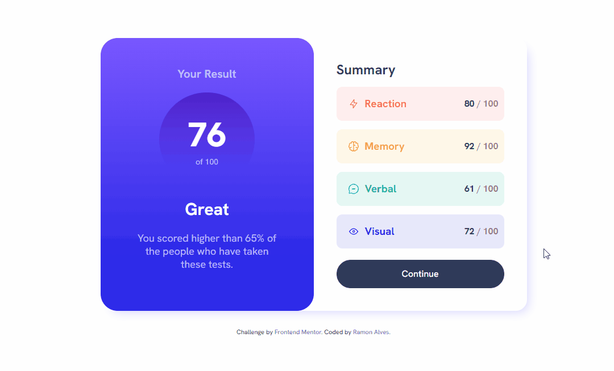
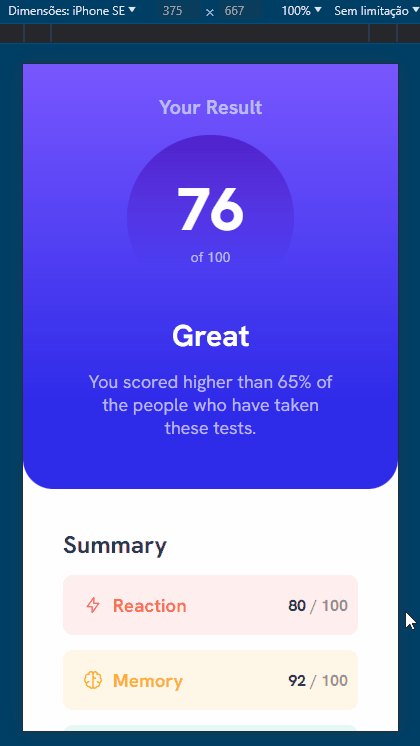
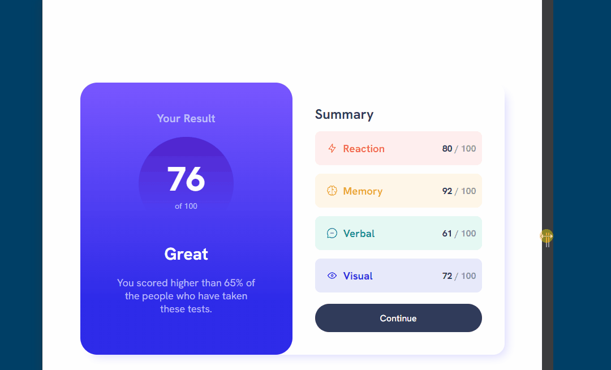
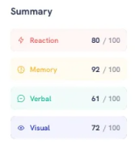
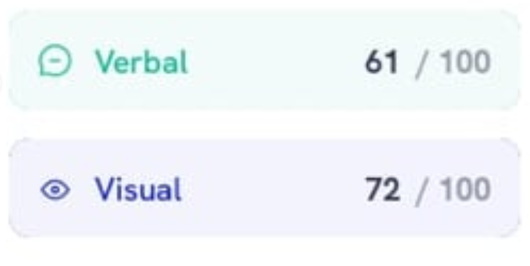

# Frontend Mentor - Results summary component solution

This is a solution to the [Results summary component challenge on Frontend Mentor](https://www.frontendmentor.io/challenges/results-summary-component-CE_K6s0maV). Frontend Mentor challenges help you improve your coding skills by building realistic projects. 

## Overview

### The challenge

Users should be able to:

- View the optimal layout for the interface depending on their device's screen size
- See hover and focus states for all interactive elements on the page
- **Bonus**: Use the local JSON data to dynamically populate the content

**Note: I dont know JSON yet :-:.**

## Screenshot

- ### Desktop 


- ### Mobile


- ### Responsivity



### Links

- Solution URL: [FrontEnd Mentor](https://www.frontendmentor.io/solutions/-html5-e-css-4-newbie-results-summary-component-k2DM9G34CE)
- Live Site URL: [Live Site](https://ramon-alvez.github.io/Frontend-Mentor-HTML-CSS-Newbie-Results-summary/)

## My process

### Built with

- Semantic HTML5 markup
- CSS custom properties
- Flexbox

**Note: These are just examples. Delete this note and replace the list above with your own choices**

### What I learned

  I Really liked to code this "button", and here I learned how to use pseudo-elements in the code

```css
#reaction{
    background-color: var(--ReactionSmooth);

    }

    #reaction .categoryTitle{
        color: var(--Reaction);
    }

    #reaction .categoryTitle::before{
        content: '';
        background-image: url(../images/icon-reaction.svg);
        background-repeat: no-repeat;
        display: inline-block;
        width: 20px;
        height: 20px;
        margin: 10px;
}
```

  Other thing I learned is about of this section, I noticed in design that the corners of this "buttons" have a solid border on the radio but not in the form itself, here some pics:

  -  
  -  

  I tried a lot of things to do this but I couldn't realize how to do it, I tried with border attributes, grandients and masks. 

  After a lot of time researching and trying different things, I found a workaround that allowed me to do this, but it would be too complicated and certainly not intuitive:
  - The solution consisted of creating an empty div that would be above the container, and using before and after to style each border individually, adding the radius and solid edges of the corners, this pseudo element would have the size of the border radius, so when by a solid border at the ends there would be nothing left

  I don't know if I could explain properly, but I guess this isn't the right way to do this, but since this is a newbie challenge maybe I can leave that aside for a while :/.

  But If anyone have some idea how to do it, I'm glad to learn :D.

### Continued development

My current goal is to finish all the FrontEnd Mentor challenges, to train and learn in the process.

## Author

- GitHub - [Ramon Alvez](https://github.com/Ramon-Alvez)
- Frontend Mentor - [@Ramon Alvez](https://www.frontendmentor.io/profile/Ramon-Alvez)
- LinkedIn - [@Ramon Alvez](https://www.linkedin.com/in/ramon-alvez/)
